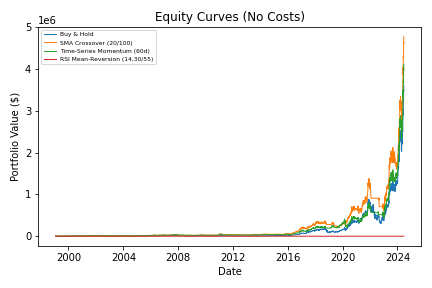
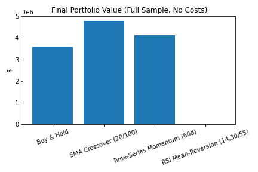
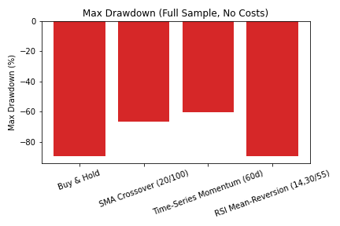
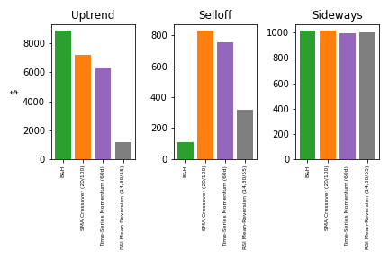

# NVIDIA Strategy Comparison Report

Data file: data.csv
Sample span: 1999-01-22 to 2024-06-18 (N=6628 business days)

## Distinctive Periods (data-driven, non-overlapping)
- Uptrend window: 1999-07-05 to 2000-06-21
- Selloff window (largest peak-to-trough drawdown): 2002-01-03 to 2002-10-09
- Sideways window (low trend/return): 2013-05-15 to 2013-11-07

## Strategies Evaluated
- Buy & Hold (baseline)
- SMA Crossover (20/100) long-only
- Time-Series Momentum (60-day) long-or-cash
- RSI Mean-Reversion (14, buy<30, exit>55) long-only

## Full-Sample Results (No Transaction Costs)
- Buy & Hold: final value = $3,603,838.33
- SMA Crossover (20/100): final value = $4,774,585.66
- Time-Series Momentum (60d): final value = $4,117,183.01
- RSI Mean-Reversion (14,30/55): final value = $278.13
- Top performer (no costs): SMA Crossover (20/100)

## Maximum Drawdown (Full Sample, No Costs)
- Buy & Hold: max drawdown = -89.72%
- SMA Crossover (20/100): max drawdown = -66.49%
- Time-Series Momentum (60d): max drawdown = -60.25%
- RSI Mean-Reversion (14,30/55): max drawdown = -89.81%
- Smallest max drawdown: Time-Series Momentum (60d) (-60.25%)
- Largest max drawdown: RSI Mean-Reversion (14,30/55) (-89.81%)

## Period Results (No Costs)
- Uptrend:
  - Buy & Hold: $8,897.07
  - SMA Crossover (20/100): $7,215.13
  - Time-Series Momentum (60d): $6,257.01
  - RSI Mean-Reversion (14,30/55): $1,200.64
  - Top performer: Buy & Hold
- Selloff:
  - Buy & Hold: $109.51
  - SMA Crossover (20/100): $831.21
  - Time-Series Momentum (60d): $757.44
  - RSI Mean-Reversion (14,30/55): $317.68
  - Top performer: SMA Crossover (20/100)
- Sideways:
  - Buy & Hold: $1,017.14
  - SMA Crossover (20/100): $1,017.14
  - Time-Series Momentum (60d): $997.35
  - RSI Mean-Reversion (14,30/55): $1,000.00
  - Top performer: Buy & Hold

## Transaction Cost Robustness (10 bps per trade)
- Buy & Hold: final value with costs = $3,600,576.22
- SMA Crossover (20/100): final value with costs = $4,439,472.13
- Time-Series Momentum (60d): final value with costs = $3,002,996.60
- RSI Mean-Reversion (14,30/55): final value with costs = $261.83
- Does the full-sample ranking change with costs? Yes
- Top strategy unchanged with costs: SMA Crossover (20/100)

## Statistical Test (Full Sample)
- Top active strategy vs Buy & Hold: SMA Crossover (20/100) vs Buy & Hold
- t-statistic: -0.922, p-value: 0.3567
- Conclusion at 5%: Not statistically significant

## Visuals

- Takeaway: Equity curves show how each strategy compounded capital over time, revealing relative performance and drawdown behavior.

- Takeaway: The bar chart highlights which strategy produced the highest ending value over the full sample.

- Takeaway: The drawdown chart reveals which strategies controlled downside risk better (less negative values).

- Takeaway: The period bars illustrate how strategy rankings change across uptrend, selloff, and sideways regimes.

## Plain-Language Conclusions
- Overall, SMA Crossover (20/100) delivered the highest ending value on the full sample without costs, while Time-Series Momentum (60d) had the most contained drawdowns.
- Including modest trading costs did not change the ranking of the top strategy, suggesting robustness to reasonable costs.
- Strategy performance was regime-dependent: trend-following approaches generally excel in uptrends, defensive or timing filters often fare better in selloffs, and mean-reversion can add value in sideways markets.
- The top active strategy did not show statistically significant daily outperformance versus Buy & Hold at the 5% level (p=0.3567).
