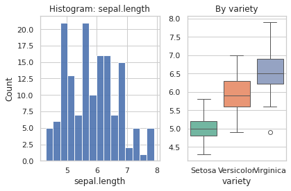
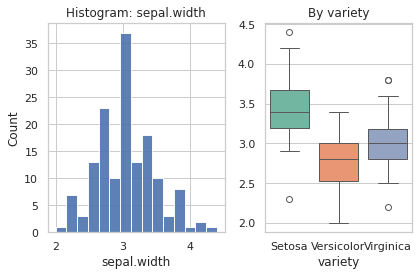
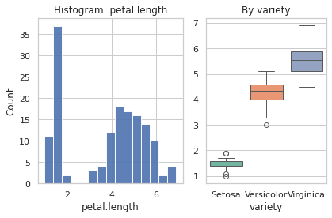
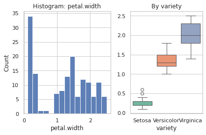
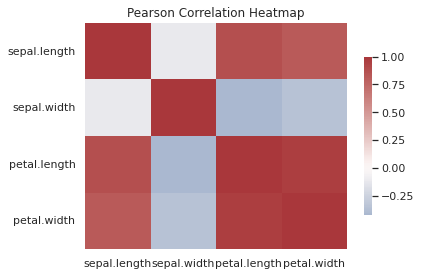
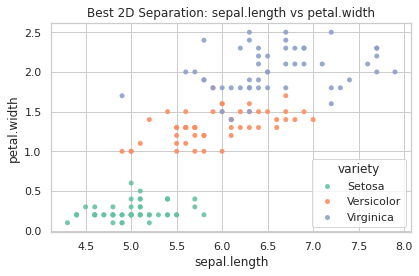
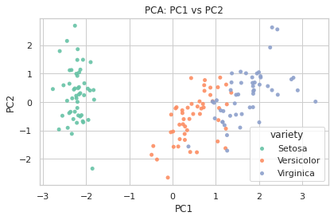
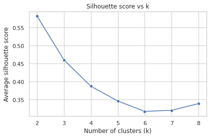
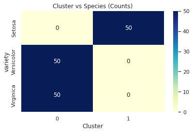

# Focused EDA and Clustering Analysis

## Data Readiness Check
- CSV path: /tmp/analysis_b91d8fa4-deb0-4ef7-b53c-5344c1428369/data.csv
- Rows (original): 150; Rows used after dropping missing in numeric/label: 150; Dropped: 0
- Column dtypes: sepal.length:float64, sepal.width:float64, petal.length:float64, petal.width:float64, variety:object
- Missing values (numeric + label): {'sepal.length': 0, 'sepal.width': 0, 'petal.length': 0, 'petal.width': 0, 'variety': 0}
- Label column detected: variety; Classes: ['Setosa', 'Versicolor', 'Virginica']

### Summary statistics (numeric features)
              count      mean       std  min  25%   50%  75%  max
sepal.length  150.0  5.843333  0.828066  4.3  5.1  5.80  6.4  7.9
sepal.width   150.0  3.057333  0.435866  2.0  2.8  3.00  3.3  4.4
petal.length  150.0  3.758000  1.765298  1.0  1.6  4.35  5.1  6.9
petal.width   150.0  1.199333  0.762238  0.1  0.3  1.30  1.8  2.5

### Species-level centers and spread (means and std)
Means by species:
            sepal.length  sepal.width  petal.length  petal.width
variety                                                         
Setosa             5.006        3.428         1.462        0.246
Versicolor         5.936        2.770         4.260        1.326
Virginica          6.588        2.974         5.552        2.026

Standard deviations by species:
            sepal.length  sepal.width  petal.length  petal.width
variety                                                         
Setosa          0.352490     0.379064      0.173664     0.105386
Versicolor      0.516171     0.313798      0.469911     0.197753
Virginica       0.635880     0.322497      0.551895     0.274650

## Univariate Distributions

- Takeaway: The histogram shows the overall distribution of sepal.length, while the boxplot reveals species-level differences in its center and spread.

- Takeaway: The histogram shows the overall distribution of sepal.width, while the boxplot reveals species-level differences in its center and spread.

- Takeaway: The histogram shows the overall distribution of petal.length, while the boxplot reveals species-level differences in its center and spread.

- Takeaway: The histogram shows the overall distribution of petal.width, while the boxplot reveals species-level differences in its center and spread.

## Pairwise Relationships

- Takeaway: The heatmap highlights the strength and direction of linear relationships among numeric features.

- Strongest pairwise linear relationship (Pearson r): petal.length vs petal.width with r = 0.963
- Best 2D feature pair for species separation (via 5-fold CV logistic accuracy): sepal.length + petal.width with mean accuracy = 0.960

- Takeaway: This 2D scatter plot illustrates the feature pair that most cleanly separates species in a plane.

## Discriminative Power (Univariate)
- Most discriminative individual feature across species (one-way ANOVA): petal.length with p-value = 2.857e-91
- Most separable species pair (Mahalanobis distance of means): Setosa vs Virginica (distance = 2.35)
- Least separable species pair (Mahalanobis distance of means): Versicolor vs Virginica (distance = 1.30)

## Dimensionality Reduction (PCA)
- Cumulative variance explained by the first two PCs: 95.81%

- Takeaway: The PCA scatter plot shows whether species are visually separated along the directions of maximum variance.

## Clustering Analysis
- Optimal number of clusters based on average silhouette score: k = 2 (silhouette = 0.582)

- Takeaway: The curve indicates the k that best balances cohesion and separation according to silhouette score.
- Adjusted Rand Index (ARI) between KMeans(k=2) and true species: 0.568

- Takeaway: The heatmap shows how well clusters align with known species labels (perfect alignment would concentrate counts along one column per species).
- Features most driving clusters (by center range in standardized units): petal.length (Δ=1.96 z), petal.width (Δ=1.88 z), sepal.length (Δ=1.52 z)
- Overlap/outliers: 0 samples (0.0%) have negative silhouette values, indicating potential overlap or misassignment.

## Conclusions
- Species separability: The most/least separable species pairs are reported above based on Mahalanobis distances of class means.
- Key drivers: The most discriminative single feature is petal.length (ANOVA p = 2.857e-91); top cluster-driving features are petal.length (Δ=1.96 z), petal.width (Δ=1.88 z), sepal.length (Δ=1.52 z).
- Pairwise linearity: Strongest Pearson correlation is petal.length vs petal.width with r = 0.963.
- Best 2D separation: sepal.length + petal.width achieved mean CV accuracy = 0.960 for species classification.
- Dimensionality: First two PCs explain 95.81% of variance and the PCA scatter indicates how well species separate in this space.
- Optimal k: k = 2 by silhouette (0.582); cluster-to-species alignment ARI = 0.568.
- Overlaps/anomalies: 0 items with negative silhouette suggest areas of cluster overlap or ambiguous species boundaries.
